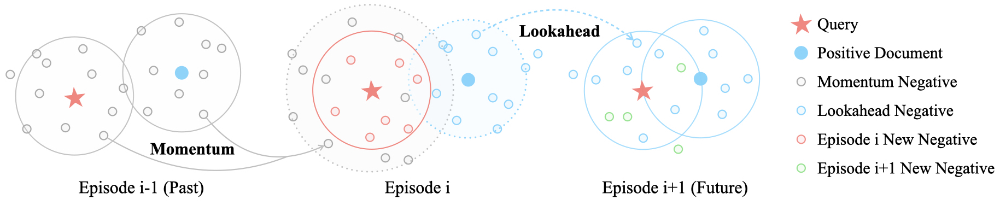

# ANCE-Tele

This is the official implementation of ANCE-Tele described in the EMNLP 2022 (main conference) paper **Reduce Catastrophic Forgetting of Dense Retrieval Training with Teleportation Negatives**. If you find this work useful, please cite our paper 🔗 and give us a star ⭐️. Thank You ~ 

```
@inproceedings{sun2022ancetele,
  title={Reduce Catastrophic Forgetting of Dense Retrieval Training with Teleportation Negatives},
  author={Si Sun, Chenyan Xiong, Yue Yu, Arnold Overwijk, Zhiyuan Liu and Jie Bao},
  booktitle={Proceedings of EMNLP 2022},
  year={2022}
}
```


## Overview



ANCE-Tele is a simple and efficient DR training method that introduces teleportation (momentum and lookahead) negatives to smooth the learning process, leading to improved training stability, convergence speed, and reduced catastrophic forgetting.

On web search and OpenQA, ANCE-Tele is competitive among systems using significantly more (50x) parameters, and eliminates the dependency on additional negatives (e.g., BM25, other DR systems), filtering strategies, and distillation modules. 
 
You thus can easily reproduce ANCE-Tele about one day with only an A100 😉. (Of course, 2080Ti is also possible but with more time). Let's begin !


## Outline

- [ANCE-Tele](#ance-tele)
  - [Requirements](#requirements)
  - [Download Data & CheckPs](#download-data-checkps)
  - [Reproduce w/ Our CheckPs](#reproduce-w/-our-checkps)
  - [Reproduce w/ Our Training Data](#reproduce-w/-our-training-data)
  - [Reproduce MS MARCO from Scratch](#reproduce-ms-marco-from-scratch)
  - [Reproduce NQ from Scratch](#reproduce-nq-from-scratch)
  - [Reproduce TriviaQA from Scratch](#reproduce-triviaqa-from-scratch)
  - [Contact Us](#acknowledgement)
  - [Acknowledgement](#acknowledgement)

## Requirements


## Download Data & CheckPs

## Reproduce w/ Our CheckPs

## Reproduce w/ Our Training Data


## Reproduce MS MARCO from Scratch

## Reproduce NQ from Scratch


## Reproduce TriviaQA from Scratch


## Environment

```
GPU: A100-SXM4-40GB
CUDA Version: 11.2
Python: 3.8
```
## Requirements

```
pytorch==1.8.0
transformers==4.9.2
datasets==1.11.0
faiss-gpu==1.7.2
tensorboardX==2.5.1
```


> **Let's Reproduce!**


## >> Episode-0

### 0.1/ Preprocess data

* Download data
  ```
  bash shells/download_data.sh
  ```

* Tokenize data
  ```
  bash shells/tokenize_data.sh
  ```

### 0.2/ Mine Training negatives

* Zero-shot Inference & Mine training negatives

  ```
  bash shells/mine-epi-0.sh
  ```


## >> Episode-1

### 1.1/ Training

* Train & Inference

  ```
  bash shells/train-epi-1.sh
  ```

### 1.2/ Mine Training negatives

* Prepare checkpoint-20k
  ```
  export DATA_DIR=/data/private/sunsi/dataset/msmarco/rocketqa
  export OUTPUT_DIR=/data/private/sunsi/experiments/cocondenser/results
  ## *************************************
  ## Prepare CheckP-20k
  ## *************************************
  mkdir ${OUTPUT_DIR}/epi-1.ance-tele.co-condenser-marco.checkpoint-20000
  cp ${OUTPUT_DIR}/epi-1.ance-tele.co-condenser-marco/checkpoint-20000/* ${OUTPUT_DIR}/epi-1.ance-tele.co-condenser-marco.checkpoint-20000
  cp ${OUTPUT_DIR}/epi-1.ance-tele.co-condenser-marco/special_tokens_map.json ${OUTPUT_DIR}/epi-1.ance-tele.co-condenser-marco.checkpoint-20000
  cp ${OUTPUT_DIR}/epi-1.ance-tele.co-condenser-marco/tokenizer_config.json ${OUTPUT_DIR}/epi-1.ance-tele.co-condenser-marco.checkpoint-20000
  cp ${OUTPUT_DIR}/epi-1.ance-tele.co-condenser-marco/vocab.txt ${OUTPUT_DIR}/epi-1.ance-tele.co-condenser-marco.checkpoint-20000
  ```

* Mine new training negatives
  ```
  bash shells/mine-epi-1.sh
  ```

## >> Episode-2

### 2.1/ Training

* Train & Inference

  ```
  bash shells/train-epi-2.sh
  ```


### 2.2/ Mine Training negatives

* Prepare checkpoint-20k
  ```
  export DATA_DIR=/data/private/sunsi/dataset/msmarco/rocketqa
  export OUTPUT_DIR=/data/private/sunsi/experiments/cocondenser/results
  ## *************************************
  ## Prepare CheckP-20k
  ## *************************************
  mkdir ${OUTPUT_DIR}/epi-2.ance-tele.co-condenser-marco.checkpoint-20000
  cp ${OUTPUT_DIR}/epi-2.ance-tele.co-condenser-marco/checkpoint-20000/* ${OUTPUT_DIR}/epi-2.ance-tele.co-condenser-marco.checkpoint-20000
  cp ${OUTPUT_DIR}/epi-2.ance-tele.co-condenser-marco/special_tokens_map.json ${OUTPUT_DIR}/epi-2.ance-tele.co-condenser-marco.checkpoint-20000
  cp ${OUTPUT_DIR}/epi-2.ance-tele.co-condenser-marco/tokenizer_config.json ${OUTPUT_DIR}/epi-2.ance-tele.co-condenser-marco.checkpoint-20000
  cp ${OUTPUT_DIR}/epi-2.ance-tele.co-condenser-marco/vocab.txt ${OUTPUT_DIR}/epi-2.ance-tele.co-condenser-marco.checkpoint-20000
  ```


* Mine new training negatives
  ```
  bash shells/mine-epi-2.sh
  ```

## >> Episode-3

* Train & Inference

  ```
  bash shells/train-epi-3.sh
  ```


## Contact

For any question, feel free to create an issue, and we will try our best to solve. If the problem is more urgent, you can send an email to me at the same time 🤗.

```
NAME: Si Sun
EMAIL: s-sun17@mails.tsinghua.edu.cn
```